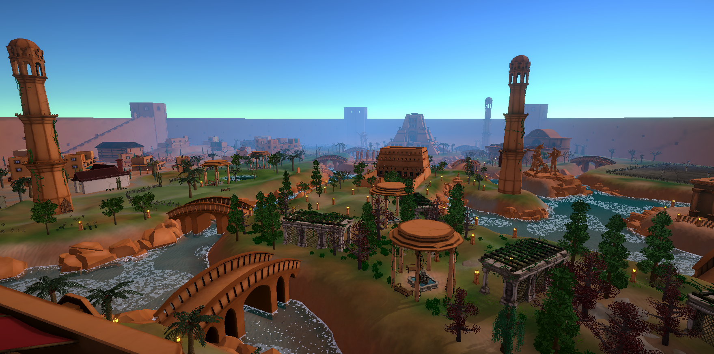
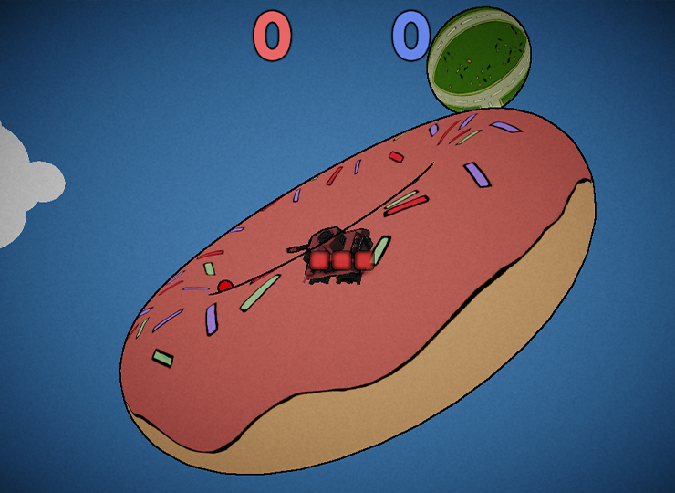

For detailed information, check out my CV and portfolio!

- [CV](./assets/CV.pdf)
- [Portfolio](./assets/Portfolio.pdf)
- [YouTube Projects Showcase](https://www.youtube.com/watch?v=fz0zxoRKbjo)

# Open Source Projects

## [Cockroach](https://github.com/efekaanaltas/Cockroach)

A game engine for 2D platformers completely developed by me with C++ and OpenGL. It features a batch renderer that can render millions of sprites, a particle system, a rich level editor and more.

## [Nanovox](https://github.com/efekaanaltas/Nanovox/)

A high performance voxel renderer using C++ and OpenGL. It streams multiple chunks asynchronously via multithreading. It also does the entire rendering on the GPU side with instancing, which results in incredible performance.

## [PBR Renderer](https://github.com/efekaanaltas/PBR/)
A physically based renderer with directional and point light shadows, skybox reflections, normal/depth/parallax mapping and more. Made with C++ and OpenGL.

# Other Projects

## Godslain

A middle-sized open world RPG set in a fantasy world. Features army management.

## Goblin War Camp
[Google Play Link](https://play.google.com/store/apps/details?id=com.demecate.IdleGameGoblinWarCamp&hl=en-US)

An idle game. Build your war camp, raise an unstoppable army, and burn human settlements to the ground!

## OctoCombat
[Google Play Link](https://play.google.com/store/apps/details?id=com.DefaultCompany.Hordeshooter&hl=en-US)

An arcade hordeshooter where you fight against crabs as an octopus that can wield up to 4 weapons!

## Orbitanks

In development!
Fight your opponent on various planets in Orbitanks! The matches are blazingly fast, so all decisions matter! Strategize your shots and movements with accordance to the planet. Remember: You will have to dodge your own bullets as well!