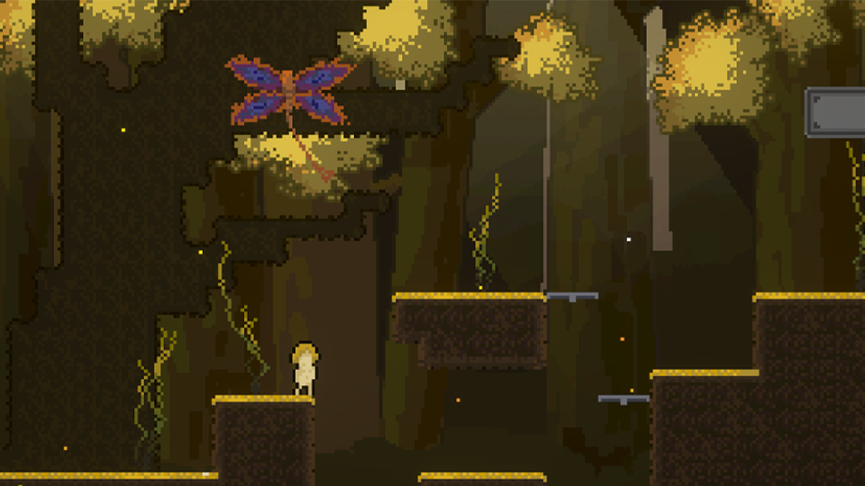
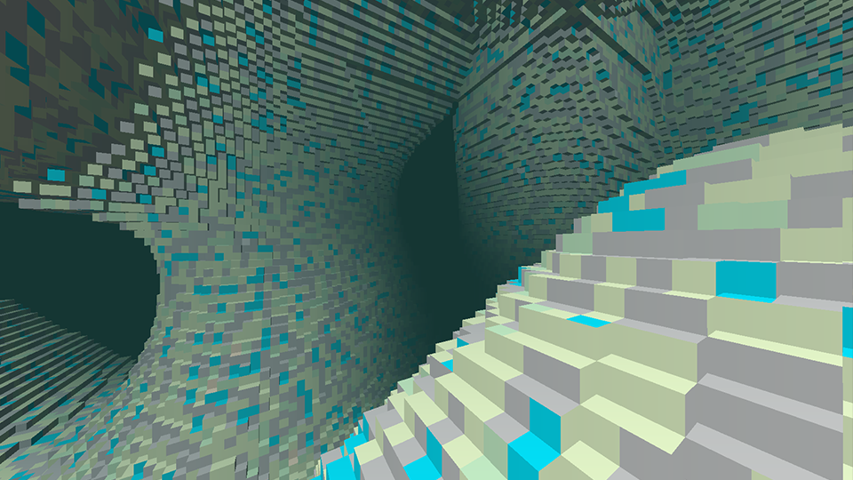

- [CV](./assets/CV.pdf)
- [Portfolio](./assets/Portfolio.pdf)
- [YouTube Projects Showcase](https://www.youtube.com/watch?v=fz0zxoRKbjo)

# Cockroach

[Link to Project](https://github.com/efekaanaltas/Cockroach)
A game engine for 2D platformers completely developed by me with C++ and OpenGL. It features a batch renderer that can render millions of sprites, a particle system, a rich level editor and more.

# Nanovox

[Link to Project](https://github.com/efekaanaltas/Nanovox/)
A high performance voxel renderer using C++ and OpenGL. It streams multiple chunks asynchronously via multithreading. It also does the entire rendering on the GPU side with instancing, which results in incredible performance.

# PBR Renderer
[Link to Project](https://github.com/efekaanaltas/PBR/)
A physically based renderer with directional and point light shadows, skybox reflections, normal/depth/parallax mapping and more. Made with C++ and OpenGL.